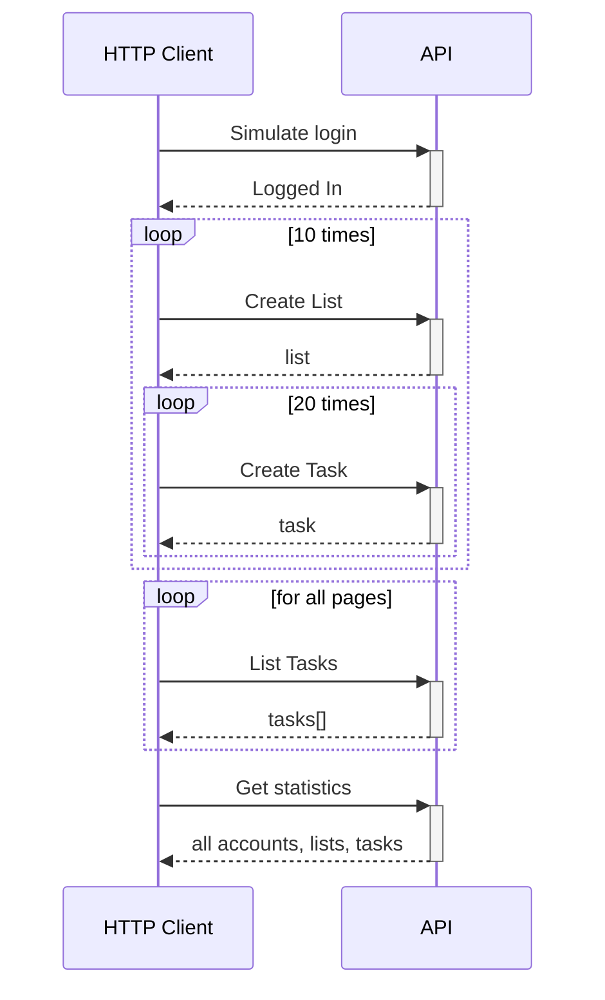

# Runner container

The runner uses [k6](https://k6.io/) to test the service specified in `SERVER_HOST` env var and execute the following load testing scenarios:

## scenario.js

```mermaid
sequenceDiagram
participant C as HTTP Client
    C->>+API: Simulate login
    API-->>-C: Logged In
    loop 10 times
        C->>+API: Create List
        API-->>-C: list
        loop 20 times
            C->>+API: Create Task
            API-->>-C: task
        end
    end
    loop for all pages
        C->>+API: List Tasks
        API-->>-C: tasks[]
    end
    C->>+API: Get statistics
    API-->>-C: all accounts, lists, tasks
```