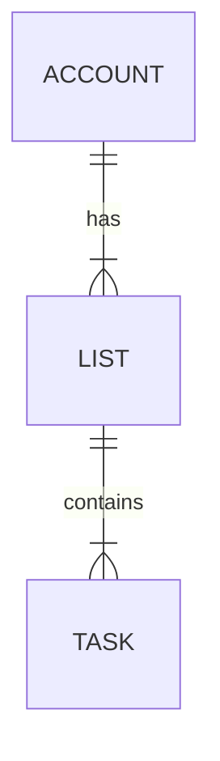

# Specifications of the service under tests

Each subfolder corresponding to an API implementation should conform to the following specifications about the data model & the API endpoints to be included in the benchmark.

## Model

Entity Diagram created using [Mermaid](https://mermaid-js.github.io/mermaid/):

Note: You can have a look on the [SQL initialization script](../migrations/20220408080000_init.sql) for more details.

## API spec

Common characteristics:

- [x] Default error handler
- [x] Data validation

An OpenAPI 3.0.0 specification is available in YAML in this repo [EcobenchmarkBackEnd-0.0.1-swagger.yaml](./EcobenchmarkBackEnd-0.0.1-swagger.yaml) or online on [SwaggerHub](https://app.swaggerhub.com/apis/agraignic/EcobenchmarkBackEnd/0.0.1).

